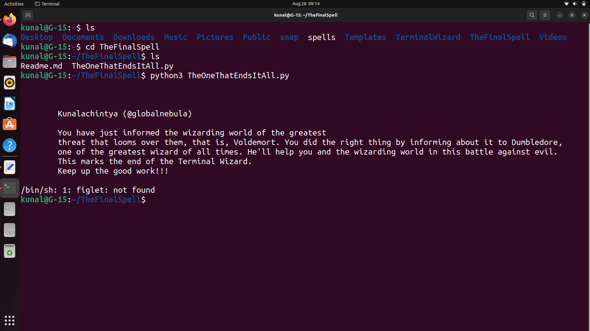

## Commands Used

### cd (Change Directory)
The `cd` command is like your GPS for the command line. It helps you navigate your file system by letting you hop between directories. Without it, you'd be lost in the digital wilderness.

### ls (List)
Think of `ls` as your digital flashlight. It shines a light on what's inside your current directory, showing you all the files and folders. No more stumbling in the dark!

### touch
Need to create a new file? Just `touch` it! This command conjures up empty files like magic. It's your go-to for bringing new documents into existence.

### cp (Copy)
`cp` is your digital photocopier. It makes exact duplicates of files and drops them wherever you want. Plus, if there's already a file with that name, `cp` will give it a fresh identity!

### mv (Move/Rename)
Want to move a file? Use `mv`. Need to rename something? It's got your back. It's like the command line's version of rearranging furniture in your house.

### mkdir (Make Directory)
`mkdir` is your tool for creating new folders or directories. Think of it as building your digital kingdom, one folder at a time.

### rm (Remove)
When it's time to declutter, `rm` is your Marie Kondo. It helps you tidy up by saying goodbye to files or folders you no longer need.

### sudo nano
Need to jot down some notes or edit a text file? `sudo nano` is your trusty text editor. It's like the notepad of the command line world.

## Git Commands Used

### git clone
`git clone` is your way of saying, "Give me a copy of that cool project!" It lets you clone a remote Git repository onto your local machine, so you can explore, tinker, and collaborate.

### git status
Ever wonder what's going on with your Git project? `git status` is like your project's mood ring. It tells you which files are happy (modified), chill (staged), or new in town (untracked).

### git add
`git add` is your stage manager. It prepares your changes for the big show (commit). You get to choose which actors (files) make it to the stage.

### git commit
Think of `git commit` as taking a snapshot of your project. It captures all the changes you've staged and stores them in your project's history. Say cheese!

### git push
`git push` is like launching a rocket. It sends your local changes to the remote repository, sharing your work with the world. Ready, set, blast off!

